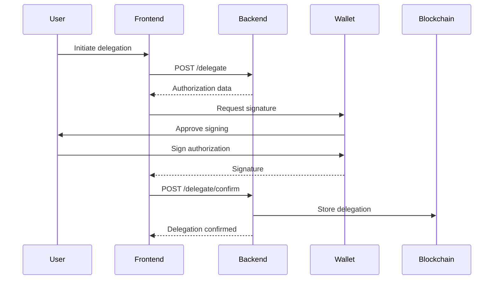
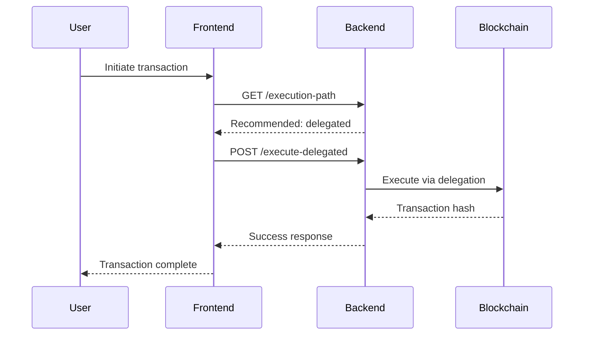

# EIP-7702 Delegation

## Table of Contents
1. [Overview](#overview)
2. [Create Delegation Authorization](#create-delegation-authorization)
3. [Confirm Delegation](#confirm-delegation)
4. [Get Profile Delegations](#get-profile-delegations)
5. [Revoke Delegation](#revoke-delegation)
6. [Execute Delegated Transaction](#execute-delegated-transaction)
7. [Get Execution Path](#get-execution-path)
8. [Delegation Flow](#delegation-flow)
9. [Security Considerations](#security-considerations)

---

## Overview

The EIP-7702 Delegation API implements account abstraction delegation, allowing users to delegate transaction execution permissions from their EOA (Externally Owned Account) to a session wallet. This enables gasless transactions and improved user experience.

### Key Features
- EIP-7702 compliant delegation authorization
- Granular permission control
- Time-based expiration
- Gas-free transaction execution
- Multi-chain support
- Automatic execution path optimization

### Authentication
All endpoints require authentication using `authenticateAccount` middleware with:
- V2 authentication adapter
- User rate limiting
- Transaction rate limiting for execution endpoints

### Base URL
```
/api/v2
```

---

## Create Delegation Authorization

Creates an unsigned delegation authorization for the frontend to sign with the user's wallet.

### Request
```
POST /api/v2/profiles/:profileId/accounts/:accountId/delegate
Authorization: Bearer <access_token>
Content-Type: application/json
```

#### Path Parameters
- `profileId`: UUID of the profile
- `accountId`: UUID of the linked account to delegate from

#### Request Body
```json
{
  "permissions": {
    "transfer": true,      // Allow ETH transfers
    "swap": true,         // Allow DEX swaps
    "approve": false,     // Allow token approvals
    "all": false          // Allow all operations
  },
  "expiresAt": "2024-12-31T23:59:59Z"  // optional, ISO 8601 datetime
}
```

#### Validation Rules
- `permissions`: Optional object with boolean flags
- `expiresAt`: Optional ISO 8601 datetime string

### Response

#### Success (200 OK)
```json
{
  "success": true,
  "data": {
    "authorizationData": {
      "chainId": 1,
      "address": "0xSessionWallet...",  // Session wallet address
      "nonce": "123456789"              // Unique nonce
    },
    "message": "Please sign this delegation authorization",
    "expiresAt": "2024-12-31T23:59:59Z"
  }
}
```

#### Error Responses
- **404 Not Found**: Profile not found
- **400 Bad Request**: Invalid permissions or expiration

### Authorization Structure
The frontend should construct and sign an EIP-7702 authorization:
```solidity
Authorization {
  chainId: uint256,
  address: address,  // Session wallet address
  nonce: uint256
}
```

---

## Confirm Delegation

Stores a signed delegation authorization on-chain.

### Request
```
POST /api/v2/profiles/:profileId/accounts/:accountId/delegate/confirm
Authorization: Bearer <access_token>
Content-Type: application/json
```

#### Path Parameters
- `profileId`: UUID of the profile
- `accountId`: UUID of the linked account

#### Request Body
```json
{
  "signature": "0xabc123...",
  "authorizationData": {
    "chainId": 1,
    "address": "0xSessionWallet...",
    "nonce": "123456789"
  },
  "permissions": {
    "transfer": true,
    "swap": true,
    "approve": false,
    "all": false
  },
  "expiresAt": "2024-12-31T23:59:59Z"  // optional
}
```

#### Validation Rules
- `signature`: Required, valid hex signature
- `authorizationData.chainId`: Required integer
- `authorizationData.address`: Required Ethereum address
- `authorizationData.nonce`: Required string

### Response

#### Success (200 OK)
```json
{
  "success": true,
  "data": {
    "id": "delegation123",
    "linkedAccountId": "account456",
    "sessionWallet": "0xSessionWallet...",
    "chainId": 1,
    "permissions": {
      "transfer": true,
      "swap": true,
      "approve": false,
      "all": false
    },
    "expiresAt": "2024-12-31T23:59:59Z",
    "isActive": true,
    "createdAt": "2024-01-01T00:00:00Z"
  }
}
```

---

## Get Profile Delegations

Retrieves all active delegations for a profile.

### Request
```
GET /api/v2/profiles/:profileId/delegations
Authorization: Bearer <access_token>
```

#### Path Parameters
- `profileId`: UUID of the profile

### Response

#### Success (200 OK)
```json
{
  "success": true,
  "data": [
    {
      "id": "delegation123",
      "linkedAccount": {
        "id": "account456",
        "address": "0x1234...5678",
        "customName": "My Hardware Wallet"
      },
      "sessionWallet": "0xSessionWallet...",
      "chainId": 1,
      "permissions": {
        "transfer": true,
        "swap": true,
        "approve": false,
        "all": false
      },
      "expiresAt": "2024-12-31T23:59:59Z",
      "isActive": true,
      "createdAt": "2024-01-01T00:00:00Z"
    }
  ]
}
```

---

## Revoke Delegation

Revokes an active delegation.

### Request
```
DELETE /api/v2/profiles/:profileId/delegations/:delegationId
Authorization: Bearer <access_token>
```

#### Path Parameters
- `profileId`: UUID of the profile
- `delegationId`: UUID of the delegation to revoke

### Response

#### Success (200 OK)
```json
{
  "success": true,
  "message": "Delegation revoked successfully"
}
```

#### Error Responses
- **404 Not Found**: Delegation not found

---

## Execute Delegated Transaction

Executes a transaction using an active delegation.

### Request
```
POST /api/v2/profiles/:profileId/execute-delegated
Authorization: Bearer <access_token>
Content-Type: application/json
```

#### Path Parameters
- `profileId`: UUID of the profile

#### Request Body
```json
{
  "delegationId": "delegation123",
  "transaction": {
    "to": "0xRecipient...",
    "value": "1000000000000000000",  // 1 ETH in wei
    "data": "0x"  // optional, hex encoded data
  }
}
```

#### Validation Rules
- `delegationId`: Required UUID
- `transaction.to`: Required Ethereum address
- `transaction.value`: Required string (wei amount)
- `transaction.data`: Optional hex string

### Response

#### Success (200 OK)
```json
{
  "success": true,
  "data": {
    "hash": "0xTransactionHash...",
    "chainId": 1,
    "from": "delegated",
    "to": "0xRecipient...",
    "value": "1000000000000000000"
  }
}
```

#### Error Responses
- **400 Bad Request**: Invalid transaction data
- **403 Forbidden**: Insufficient permissions for operation
- **404 Not Found**: Delegation not found or expired
- **429 Too Many Requests**: Transaction rate limit exceeded

### Permission Checks
The system validates that the transaction type matches the delegation permissions:
- **transfer**: Simple ETH transfers
- **swap**: DEX interactions
- **approve**: Token approval calls
- **all**: Any transaction type

---

## Get Execution Path

Determines the optimal execution path for a transaction (delegated vs direct).

### Request
```
GET /api/v2/profiles/:profileId/execution-path?to=0x...&value=0&chainId=1
Authorization: Bearer <access_token>
```

#### Path Parameters
- `profileId`: UUID of the profile

#### Query Parameters
- `to`: Required, recipient address
- `value`: Optional, amount in wei (default: "0")
- `data`: Optional, transaction data (default: "0x")
- `chainId`: Required, chain ID

### Response

#### Success (200 OK) - Delegated Path Available
```json
{
  "success": true,
  "data": {
    "recommendedPath": "delegated",
    "reason": "Linked account has active delegation - gas-free execution available"
  }
}
```

#### Success (200 OK) - Direct Path Only
```json
{
  "success": true,
  "data": {
    "recommendedPath": "direct",
    "reason": "No active delegation - will execute through session wallet"
  }
}
```

---

## Delegation Flow

### Complete Delegation Setup



### Transaction Execution Flow



---

## Security Considerations

### Delegation Security
- **Nonce Uniqueness**: Each delegation uses a unique nonce
- **Chain Isolation**: Delegations are chain-specific
- **Time Limits**: Optional expiration for temporary delegations
- **Permission Granularity**: Fine-grained control over allowed operations

### Transaction Security
- **Permission Validation**: Every transaction checked against permissions
- **Rate Limiting**: Transaction-specific rate limits
- **Audit Trail**: All delegations and executions logged
- **Revocation**: Immediate delegation cancellation

### Best Practices
1. **Minimal Permissions**: Only grant required permissions
2. **Time Limits**: Set reasonable expiration times
3. **Regular Review**: Periodically check active delegations
4. **Revoke Unused**: Remove delegations when no longer needed
5. **Monitor Activity**: Track delegation usage

---

## EIP-7702 Background

EIP-7702 introduces transaction delegation for EOAs:
- Allows EOAs to delegate execution to another address
- Enables account abstraction features for regular wallets
- Maintains self-custody while improving UX
- Gas fees can be paid by delegated address

### Benefits
- **Gasless Transactions**: Users don't need ETH for gas
- **Batched Operations**: Multiple actions in one transaction
- **Enhanced Security**: Time and permission limits
- **Better UX**: Seamless Web3 interactions