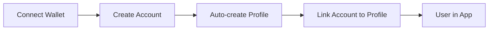
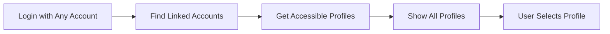

# Flat Identity Architecture for Interspace

## Overview

This document describes the new flat identity architecture for Interspace, moving away from the traditional hierarchical User → Profile → Account model to a more flexible, privacy-focused account-centric model.

## Core Philosophy

The flat identity model treats every authentication method (wallet, email, social, passkey) as a first-class account entity. Users can enter the system through any account type and access all their linked profiles seamlessly.

## Architecture Components

### 1. Accounts (Primary Entities)

```typescript
Account {
  id: string
  type: 'wallet' | 'email' | 'social' | 'passkey' | 'guest'
  identifier: string  // email address, wallet address, social ID
  provider?: string   // for social: 'google', 'apple', 'discord'
  verified: boolean
  metadata: JSON      // flexible storage
}
```

- Each authentication method creates an Account
- Accounts are the primary identity entities
- No central "User" object required

### 2. Identity Graph

```typescript
IdentityLink {
  accountAId: string
  accountBId: string
  linkType: 'direct' | 'inferred'
  privacyMode: 'linked' | 'partial' | 'isolated'
  confidenceScore: number  // for inferred links
}
```

- Links related accounts together
- Supports different privacy modes
- Can infer relationships based on usage patterns

### 3. Privacy Modes

**Linked (Default)**
- All linked accounts see all profiles
- Seamless experience across accounts
- Best for productivity

**Partial**
- Selective profile sharing
- User controls which accounts see which profiles
- Balance of convenience and privacy

**Isolated**
- Complete separation
- Account treated as independent
- Maximum privacy

### 4. SmartProfiles

```typescript
SmartProfile {
  id: string
  name: string
  sessionWalletAddress: string
  createdByAccountId: string  // which account created it
}

ProfileAccount {
  profileId: string
  accountId: string
  isPrimary: boolean
  permissions: JSON
}
```

- Profiles are activity contexts (Trading, Gaming, etc.)
- Many-to-many relationship with accounts
- Each profile has its own session wallet

## Key Features

### 1. Automatic Profile Creation

When a new account authenticates for the first time:
1. System automatically creates "My Smartprofile"
2. Links the auth account to this profile
3. Creates session wallet
4. User lands directly in the app

**No manual profile creation required!**

### 2. Flexible Account Linking

Users can link multiple account types:
- Start with MetaMask → Add email → Add Google
- All accounts can access same profiles
- Privacy mode controls visibility

### 3. Security & Privacy

- No single point of failure
- Accounts can be unlinked
- Privacy boundaries respected
- Session isolation maintained

## Implementation Flow

### New User Journey



### Existing User with Multiple Accounts



## API Endpoints

### Authentication
- `POST /api/v2/auth/authenticate` - Unified auth endpoint
- `POST /api/v2/auth/link-accounts` - Link accounts
- `PUT /api/v2/auth/link-privacy` - Update privacy mode
- `GET /api/v2/auth/identity-graph` - Get account relationships
- `POST /api/v2/auth/switch-profile/:id` - Switch active profile

### Backward Compatibility
- Legacy endpoints continue to work
- Automatic account creation for existing users
- Gradual migration path

## Database Schema

### New Tables
- `accounts` - Primary account entities
- `identity_links` - Account relationships
- `profile_accounts` - Profile-account mappings
- `account_sessions` - Session management

### Modified Tables
- `smart_profiles` - Added `createdByAccountId`
- Migration preserves all existing data

## Security Considerations

1. **Account Verification**
   - Each account type has specific verification
   - Wallet accounts verified by signature
   - Email accounts verified by code

2. **Session Management**
   - Sessions tied to accounts, not users
   - Privacy mode affects session behavior
   - Token refresh maintains session continuity

3. **Access Control**
   - Profiles accessible based on identity graph
   - Privacy boundaries enforced
   - Audit logging for all operations

## Migration Strategy

1. **Phase 1: Infrastructure**
   - Deploy new database schema
   - Add backward compatibility layer
   - Deploy V2 endpoints alongside V1

2. **Phase 2: Gradual Adoption**
   - New users use flat model
   - Existing users migrate on next login
   - Both models supported simultaneously

3. **Phase 3: Full Migration**
   - Migrate all existing data
   - Deprecate V1 endpoints
   - Remove legacy code

## Benefits

1. **User Experience**
   - No profile creation friction
   - Login with any account type
   - Access all profiles seamlessly

2. **Privacy**
   - Granular control over account linking
   - Isolated profiles for sensitive activities
   - Clear privacy indicators

3. **Security**
   - No central user entity to compromise
   - Distributed identity model
   - Account-specific security measures

4. **Developer Experience**
   - Simpler authentication flow
   - Flexible account management
   - Clear separation of concerns

## Example Scenarios

### Scenario 1: New DeFi User
1. Connects MetaMask
2. "My Smartprofile" created automatically
3. Starts using DeFi apps immediately
4. Later adds email for notifications
5. Both accounts access same profile

### Scenario 2: Privacy-Conscious Trader
1. Has existing profile with multiple accounts
2. Creates new isolated profile for trading
3. Links only specific wallet
4. Other accounts can't see trading profile
5. Complete separation maintained

### Scenario 3: Multi-Chain Power User
1. Has wallets on different chains
2. Links all wallets to same identity
3. Creates profiles for different activities
4. Switches profiles based on context
5. All wallets work across all profiles

## Conclusion

The flat identity architecture provides a more flexible, secure, and user-friendly approach to identity management in Web3. By treating all account types as equal and implementing smart privacy controls, Interspace can offer both convenience and security without compromise.