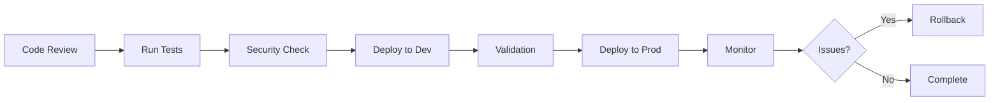

# INTERSPACE PLATFORM - DEPLOYMENT DOCUMENTATION

**Version**: 1.0.0  
**Classification**: Technical Documentation  
**Last Updated**: 2025-06-18

## DOCUMENT HIERARCHY

### 1. **DEPLOYMENT_ARCHITECTURE.md**
Military-grade technical architecture documentation containing:
- Complete system topology and network diagrams
- Security zones and boundaries
- Service communication patterns
- Threat model and security posture
- High availability and disaster recovery procedures
- Compliance and governance requirements

### 2. **DEPLOYMENT_OPERATIONS_MANUAL.md**
Comprehensive operational procedures including:
- Google Cloud SDK setup and configuration
- Step-by-step deployment procedures
- Infrastructure provisioning commands
- Service configuration details
- Monitoring and alerting setup
- Emergency procedures and runbooks

### 3. **DEPLOYMENT_CHECKLIST.md**
Operational verification checklist for:
- Pre-deployment validation
- Deployment execution steps
- Post-deployment verification
- Rollback procedures
- Documentation updates
- Sign-off requirements

### 4. **DEPLOYMENT_SUMMARY.md**
Quick reference containing:
- Current infrastructure status
- Service endpoints and configurations
- Next steps for deployment
- Important notes and warnings

## AUTOMATION SCRIPTS

### Infrastructure Management
```bash
# Create all infrastructure
./scripts/gcp-infrastructure.sh create

# Check infrastructure status
./scripts/gcp-infrastructure.sh status

# Destroy infrastructure (CAUTION!)
./scripts/gcp-infrastructure.sh destroy
```

### Deployment Automation
```bash
# Deploy to development
./scripts/gcp-deploy.sh dev

# Deploy to production
./scripts/gcp-deploy.sh prod
```

### Secrets Management
```bash
# Create all secrets
./scripts/gcp-secrets.sh create

# Rotate a specific secret
./scripts/gcp-secrets.sh rotate -s SECRET_NAME

# Backup all secrets
./scripts/gcp-secrets.sh backup

# List all secrets
./scripts/gcp-secrets.sh list

# Audit secret access
./scripts/gcp-secrets.sh audit
```

## QUICK START FOR AI AGENTS

### Understanding the System
1. Read `DEPLOYMENT_ARCHITECTURE.md` for system design
2. Review `DEPLOYMENT_OPERATIONS_MANUAL.md` for procedures
3. Check `DEPLOYMENT_SUMMARY.md` for current state

### Common Operations
```bash
# Check system status
gcloud run services list --region=us-central1
gcloud sql instances list
gcloud redis instances list --region=us-central1

# View logs
gcloud run logs read --service=interspace-backend-prod --region=us-central1 --limit=100

# Update service
gcloud run services update interspace-backend-prod \
  --region=us-central1 \
  --update-env-vars="KEY=VALUE"

# Emergency restart
gcloud run services update interspace-backend-prod \
  --region=us-central1 \
  --update-env-vars="RESTART=$(date +%s)"
```

### Security Protocols
- All secrets in Google Secret Manager
- Service accounts use least privilege
- VPC isolation for internal services
- No public IPs on databases
- MPC architecture for wallet operations

## DEPLOYMENT WORKFLOW



## CRITICAL INFORMATION

### Project Details
- **Project ID**: intersend
- **Project Number**: 784862970473
- **Primary Region**: us-central1
- **Backup Region**: us-central1 (multi-zone)

### Network Configuration
- **VPC**: interspace-vpc
- **Subnet**: 10.0.0.0/20
- **VPC Connector**: 10.8.0.16/28

### Service Endpoints
- **Backend Dev**: https://interspace-backend-dev-784862970473-uc.a.run.app
- **Backend Prod**: https://interspace-backend-prod-784862970473-uc.a.run.app
- **API Domain**: api.interspace.fi (to be configured)

### Database Instances
- **Dev**: interspace-db-dev (10.136.0.3)
- **Prod**: interspace-db-prod (10.136.0.4)

### Redis Instances
- **Dev**: interspace-redis-dev (10.122.22.251)
- **Prod**: interspace-redis-prod (10.124.225.156)

## SUPPORT AND ESCALATION

### Technical Escalation
1. **L1**: DevOps Engineer
2. **L2**: Tech Lead
3. **L3**: CTO
4. **L4**: External Support (Google Cloud)

### Documentation Updates
- Review cycle: Monthly
- Update after each major deployment
- Version control all changes
- Notify team of updates

---

**For detailed information, refer to the specific documentation files listed above.**