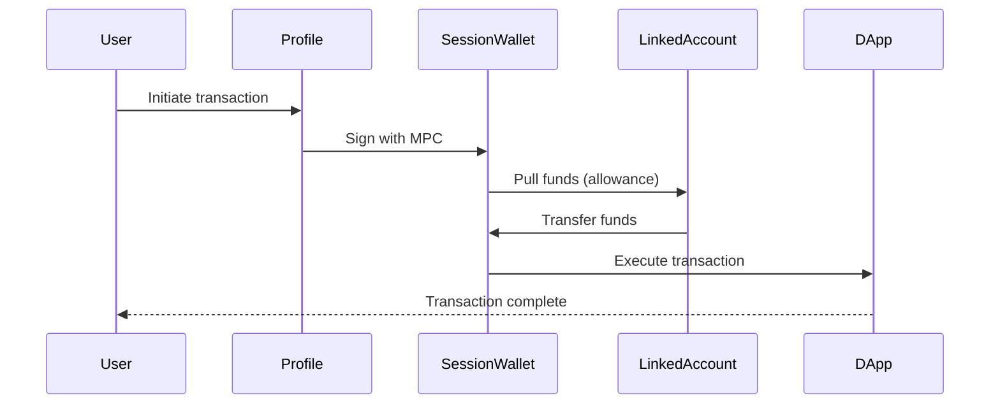

# SmartProfile V2 Technical Specification

## Overview

SmartProfiles in the V2 architecture are activity contexts that are **automatically created** for new users. Each profile represents a specific use case (Trading, Gaming, DeFi, etc.) and comes with its own MPC session wallet for seamless transactions.

### Key Changes in V2
- **Automatic Creation**: First profile "My Smartprofile" created automatically
- **Account-Centric**: Profiles are linked to accounts, not users
- **Many-to-Many**: Multiple accounts can access multiple profiles
- **Privacy-Aware**: Access controlled by identity graph and privacy modes

## Data Model

### SmartProfile Model (Updated)
```prisma
model SmartProfile {
  id                    String   @id @default(cuid())
  userId                String   // Legacy, will be deprecated
  name                  String
  sessionWalletAddress  String   @unique
  isActive              Boolean  @default(false)
  createdByAccountId    String?  // NEW: Which account created this
  
  // MPC and Orby integration
  orbyAccountClusterId  String?  @unique
  isDevelopmentWallet   Boolean  @default(false)
  
  // Relationships
  user              User              @relation(...) // Legacy
  createdByAccount  Account?          @relation("CreatedProfiles", ...)
  profileAccounts   ProfileAccount[]  // NEW: Many-to-many with accounts
  linkedAccounts    LinkedAccount[]   // External wallets
  folders           Folder[]
  apps              BookmarkedApp[]
  transactions      Transaction[]
  activeSessions    AccountSession[]  // NEW: Active sessions
  
  // Timestamps
  createdAt         DateTime @default(now())
  updatedAt         DateTime @updatedAt
}
```

### ProfileAccount Junction Table (New)
```prisma
model ProfileAccount {
  id          String       @id @default(cuid())
  profileId   String
  accountId   String
  isPrimary   Boolean      @default(false)
  permissions Json?        // Flexible permission system
  linkedAt    DateTime     @default(now())
  
  profile     SmartProfile @relation(...)
  account     Account      @relation(...)
  
  @@unique([profileId, accountId])
}
```

## Creation Flow

### Automatic Profile Creation (New Users)

```typescript
// When new account authenticates
async function handleNewUserAuth(account: Account) {
  // 1. Create session wallet
  const sessionWallet = await sessionWalletService.createSessionWallet();
  
  // 2. Create profile automatically
  const profile = await prisma.smartProfile.create({
    data: {
      name: 'My Smartprofile',
      sessionWalletAddress: sessionWallet.address,
      createdByAccountId: account.id,
      isActive: true,
      // Legacy: Create user for backward compatibility
      user: {
        create: {
          email: account.type === 'email' ? account.identifier : null,
          walletAddress: account.type === 'wallet' ? account.identifier : null
        }
      }
    }
  });
  
  // 3. Link account to profile
  await prisma.profileAccount.create({
    data: {
      profileId: profile.id,
      accountId: account.id,
      isPrimary: true,
      permissions: {
        canTransact: true,
        canManageProfile: true,
        canLinkAccounts: true
      }
    }
  });
  
  // 4. Create Orby cluster
  await orbyService.createAccountCluster(profile);
  
  return profile;
}
```

### Manual Profile Creation (Additional Profiles)

```typescript
async function createAdditionalProfile(
  accountId: string, 
  name: string,
  linkedAccounts?: string[]
) {
  // Verify account has permission
  const account = await validateAccount(accountId);
  
  // Create profile with session wallet
  const profile = await smartProfileService.createProfile({
    name,
    createdByAccountId: accountId,
    linkedAccounts
  });
  
  // Grant creating account full permissions
  await grantProfileAccess(profile.id, accountId, 'full');
  
  // Optionally share with linked accounts
  if (linkedAccounts?.length) {
    const identityLinks = await getIdentityLinks(accountId);
    for (const link of identityLinks) {
      if (link.privacyMode !== 'isolated') {
        await grantProfileAccess(profile.id, link.accountId, 'view');
      }
    }
  }
  
  return profile;
}
```

## Access Control

### Profile Access Matrix

| Privacy Mode | Own Profiles | Linked Account Profiles |
|-------------|--------------|------------------------|
| Linked      | Full Access  | Full Access           |
| Partial     | Full Access  | Configurable Access   |
| Isolated    | Full Access  | No Access             |

### Permission System

```typescript
interface ProfilePermissions {
  canView: boolean;         // See profile exists
  canTransact: boolean;     // Execute transactions
  canManageApps: boolean;   // Add/remove apps
  canManageAccounts: boolean; // Link/unlink accounts
  canDelete: boolean;       // Delete profile
}
```

## Session Wallet Integration

Each SmartProfile has a dedicated session wallet:

```typescript
interface SessionWallet {
  address: string;
  profileId: string;
  chainId: number;
  
  // MPC Configuration
  mpcKeyShareId: string;
  publicKey: string;
  
  // Capabilities
  supportsERC7702: boolean;
  supportsBatching: boolean;
  supportsGasSponsoring: boolean;
}
```

### Transaction Flow



## API Endpoints

### V2 Profile Endpoints

#### List Accessible Profiles
```http
GET /api/v2/profiles
```
Returns all profiles accessible to the authenticated account based on identity graph.

**Response:**
```json
{
  "profiles": [
    {
      "id": "prof_123",
      "name": "My Smartprofile",
      "sessionWalletAddress": "0x...",
      "isActive": true,
      "createdByAccountId": "acc_456",
      "permissions": {
        "canView": true,
        "canTransact": true,
        "canManageApps": true
      },
      "stats": {
        "linkedAccountsCount": 3,
        "appsCount": 12,
        "transactionCount": 45
      }
    }
  ],
  "totalCount": 1
}
```

#### Create Additional Profile
```http
POST /api/v2/profiles
```

**Request:**
```json
{
  "name": "DeFi Trading",
  "shareWithLinkedAccounts": true,
  "initialApps": ["uniswap", "aave"]
}
```

#### Switch Active Profile
```http
POST /api/v2/profiles/:id/activate
```
Updates session to use specified profile.

#### Share Profile Access
```http
POST /api/v2/profiles/:id/share
```

**Request:**
```json
{
  "accountId": "acc_789",
  "permissions": {
    "canView": true,
    "canTransact": false
  }
}
```

## Migration Considerations

### From V1 to V2

1. **Existing Profiles**: Remain linked to original user
2. **New Profiles**: Created with account-centric model
3. **Access**: Determined by account relationships
4. **Session Wallets**: No changes needed

### Backward Compatibility

```typescript
// V1 endpoint still works
app.get('/api/v1/profiles', authenticate, async (req, res) => {
  // Get user's profiles (legacy)
  const profiles = await getProfilesByUserId(req.user.id);
  res.json(profiles);
});

// V2 endpoint uses account
app.get('/api/v2/profiles', authenticateAccount, async (req, res) => {
  // Get accessible profiles via identity graph
  const profiles = await getAccessibleProfiles(req.account.id);
  res.json(profiles);
});
```

## Best Practices

### 1. Profile Naming
```typescript
// Good: Descriptive, activity-based
"DeFi Trading"
"NFT Collection"
"Gaming Wallet"
"Development Testing"

// Avoid: Generic names
"Profile 1"
"New Profile"
"Untitled"
```

### 2. Access Management
```typescript
// Always check permissions before operations
async function updateProfile(accountId: string, profileId: string, updates: any) {
  const access = await checkProfileAccess(accountId, profileId);
  
  if (!access.canManageProfile) {
    throw new Error('Insufficient permissions');
  }
  
  return profileService.update(profileId, updates);
}
```

### 3. Session Wallet Security
- Never expose MPC key shares
- Always verify transaction signatures
- Implement spending limits
- Monitor for unusual activity

## Advanced Features

### Profile Templates
```typescript
const templates = {
  'defi-trader': {
    name: 'DeFi Trading',
    apps: ['uniswap', 'aave', 'compound'],
    settings: { slippage: 0.5, gasMode: 'fast' }
  },
  'nft-collector': {
    name: 'NFT Collection',
    apps: ['opensea', 'blur', 'rarible'],
    settings: { autoApprove: false }
  }
};
```

### Cross-Profile Operations
```typescript
// Transfer assets between profiles
async function crossProfileTransfer(
  fromProfileId: string,
  toProfileId: string,
  asset: Asset,
  amount: BigNumber
) {
  // Verify both profiles accessible
  const access = await verifyProfileAccess(accountId, [fromProfileId, toProfileId]);
  
  // Execute via session wallets
  return sessionWalletService.transfer(
    fromProfileId,
    toProfileId,
    asset,
    amount
  );
}
```

## Conclusion

SmartProfiles V2 provide a flexible, secure way to organize crypto activities while maintaining the simplicity users expect. The automatic creation of the first profile removes onboarding friction, while the account-centric model enables powerful multi-account workflows.