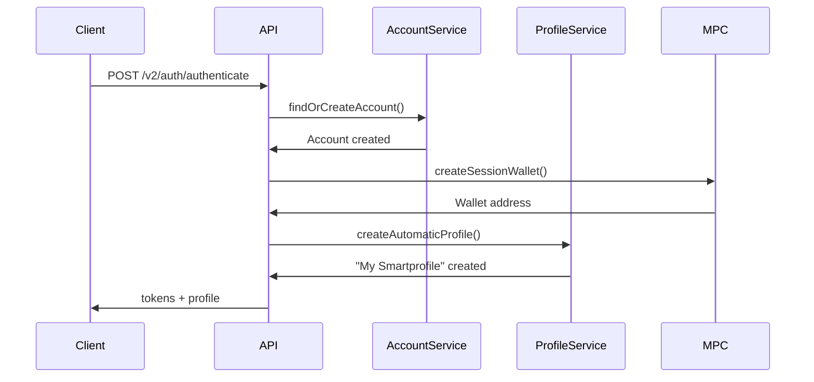
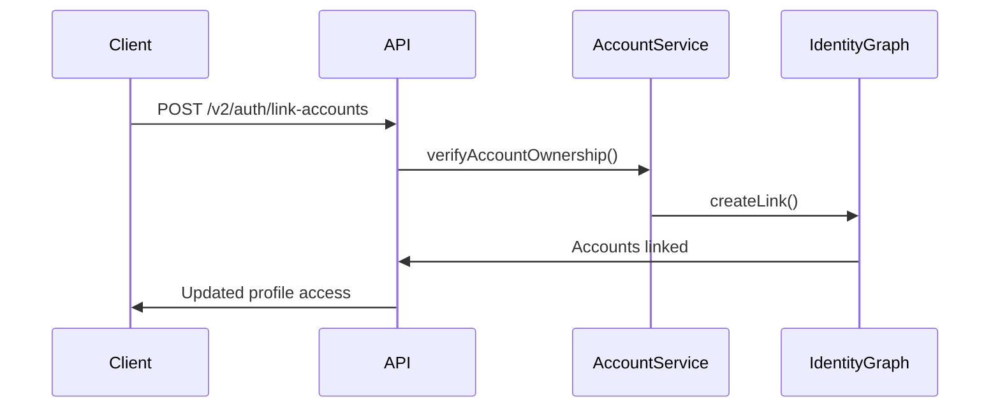

# Interspace Backend Architecture V2

This document provides a comprehensive overview of the Interspace backend with the new flat identity architecture.

## Architecture Evolution

### V1 (Hierarchical)
```
User → SmartProfiles → LinkedAccounts
```

### V2 (Flat Identity) 🆕
```
Accounts ↔ Identity Graph ↔ SmartProfiles
```

## Core Architecture Components

### 1. Flat Identity Model

The backend now treats every authentication method as a first-class **Account** entity:

- **Wallet Accounts**: MetaMask, Coinbase, WalletConnect addresses
- **Email Accounts**: Verified email addresses
- **Social Accounts**: Google, Apple, Discord identities
- **Passkey Accounts**: WebAuthn credentials
- **Guest Accounts**: Temporary anonymous sessions

```typescript
interface Account {
  id: string;
  type: AccountType;
  identifier: string;  // unique per type
  verified: boolean;
  metadata?: object;
}
```

### 2. Identity Graph

Accounts are connected through an **Identity Graph** that respects privacy boundaries:

```typescript
interface IdentityLink {
  accountAId: string;
  accountBId: string;
  linkType: 'direct' | 'inferred';
  privacyMode: 'linked' | 'partial' | 'isolated';
}
```

### 3. SmartProfiles (Enhanced)

SmartProfiles remain activity contexts but with key improvements:

- **Automatic Creation**: First profile created automatically for new users
- **Many-to-Many**: Multiple accounts can access multiple profiles
- **Session Wallets**: Each profile still has its ERC-7702 proxy wallet
- **Privacy-Aware**: Access controlled by identity graph

### 4. Session Management

Sessions are now account-based with privacy modes:

```typescript
interface AccountSession {
  accountId: string;
  sessionToken: string;
  privacyMode: PrivacyMode;
  activeProfileId?: string;
  expiresAt: Date;
}
```

## Technology Stack

- **Framework**: Express.js with TypeScript
- **Database**: PostgreSQL with Prisma ORM
- **Authentication**: JWT with account-based sessions
- **MPC Wallets**: Silence Labs two-party computation
- **Chain Abstraction**: Orby integration
- **Real-time**: Socket.IO for live updates
- **Security**: Helmet, CORS, rate limiting

## API Structure

### V2 Endpoints (New) 🆕

Base: `/api/v2`

- `/auth/authenticate` – Unified authentication for all account types
- `/auth/link-accounts` – Link accounts together
- `/auth/identity-graph` – View account relationships
- `/auth/switch-profile` – Change active profile
- `/profiles` – Access-controlled profile management
- `/accounts` – Account management

### V1 Endpoints (Legacy)

Base: `/api/v1`

- Still supported for backward compatibility
- Mapped internally to V2 services
- Will be deprecated in future releases

## Data Flow Examples

### New User Registration



### Account Linking



## Database Schema (Key Tables)

### New Tables

```sql
-- Primary account entities
accounts (
  id, type, identifier, verified, metadata
)

-- Account relationships
identity_links (
  account_a_id, account_b_id, link_type, privacy_mode
)

-- Profile access control
profile_accounts (
  profile_id, account_id, permissions
)

-- Account-based sessions
account_sessions (
  account_id, session_token, privacy_mode, active_profile_id
)
```

### Modified Tables

```sql
-- SmartProfiles now linked to accounts
smart_profiles (
  ...,
  created_by_account_id  -- NEW
)
```

## Service Architecture

### Core Services

1. **AccountService** (New)
   - Account creation and verification
   - Identity graph management
   - Privacy mode enforcement

2. **AuthControllerV2** (New)
   - Unified authentication
   - Account linking
   - Session management

3. **SmartProfileService** (Enhanced)
   - Automatic profile creation
   - Access control via identity graph
   - Backward compatibility

4. **SessionWalletService**
   - MPC wallet creation
   - Transaction signing
   - No changes from V1

5. **OrbyService**
   - Chain abstraction
   - Gas sponsoring
   - No changes from V1

## Security Enhancements

### 1. No Single Point of Failure
- No central "User" entity
- Distributed identity across accounts
- Resilient to account compromise

### 2. Privacy Controls
- Granular linking permissions
- Isolated account support
- Audit trail for all operations

### 3. Session Security
- Account-specific sessions
- Privacy mode enforcement
- Device tracking

## Migration Strategy

### Phase 1: Parallel Operation
- V2 endpoints alongside V1
- Automatic account creation for existing users
- No breaking changes

### Phase 2: Gradual Migration
- New users on V2 by default
- Existing users migrated on login
- Performance monitoring

### Phase 3: V1 Deprecation
- Remove V1 endpoints
- Clean up legacy code
- Full V2 operation

## Development Workflow

### Setup
```bash
# Install dependencies
npm install

# Run migrations (includes flat identity)
npm run prisma:migrate

# Start development server
npm run dev
```

### Testing
```bash
# Run all tests
npm test

# Run V2 tests specifically
npm test -- --grep "V2"

# Test migration
npm run test:migration
```

### Environment Variables
```env
# New V2 settings
ENABLE_V2_API=true
DEFAULT_PRIVACY_MODE=linked
AUTO_CREATE_PROFILE=true
```

## Performance Considerations

### Optimizations
- Indexed account lookups
- Cached identity graphs
- Efficient permission checks

### Monitoring
- Account creation rate
- Link traversal time
- Session validation performance

## Best Practices

### 1. Account Management
```typescript
// Always normalize identifiers
const account = await accountService.findOrCreateAccount({
  type: 'email',
  identifier: email.toLowerCase()
});
```

### 2. Privacy Checks
```typescript
// Respect privacy boundaries
if (link.privacyMode === 'isolated') {
  throw new ForbiddenError('Account is isolated');
}
```

### 3. Backward Compatibility
```typescript
// Support both user and account auth
const identity = req.user || req.account;
```

## Future Enhancements

1. **Decentralized Identity**
   - DID integration
   - Verifiable credentials
   - Cross-platform identity

2. **Advanced Privacy**
   - Zero-knowledge proofs
   - Selective disclosure
   - Anonymous credentials

3. **Identity Recovery**
   - Social recovery
   - Multi-party computation
   - Time-locked recovery

## Conclusion

The V2 architecture provides a more flexible, secure, and user-friendly identity system while maintaining full backward compatibility. The flat identity model aligns with Web3 principles while delivering the seamless experience users expect.