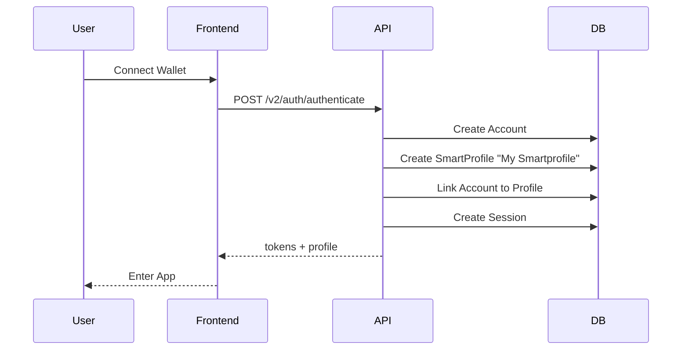
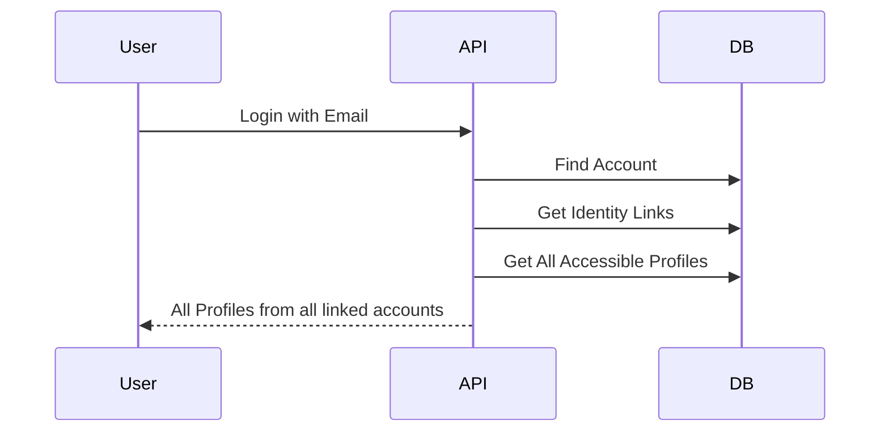
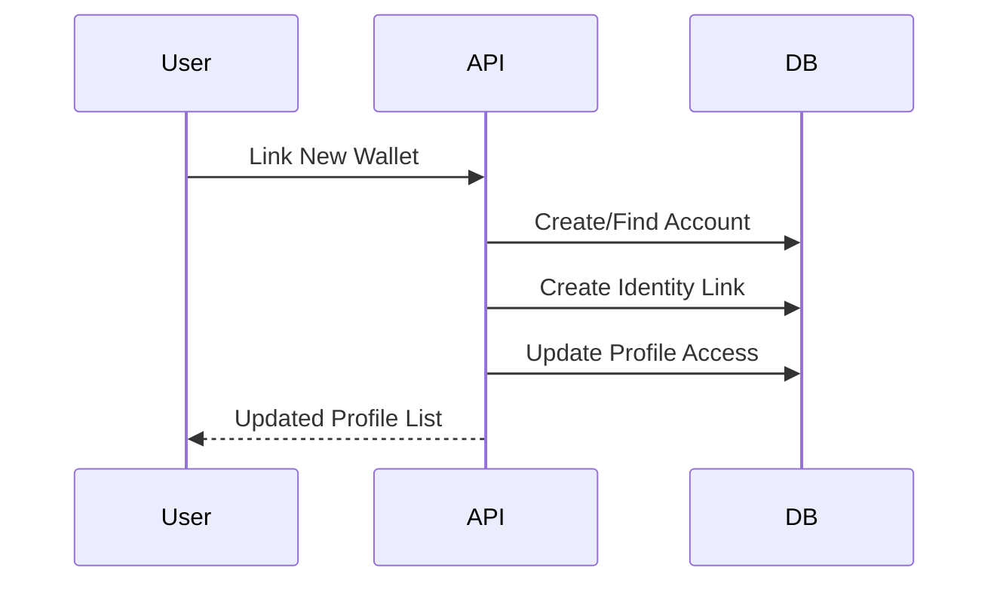

# Identity Management Documentation

## Overview

Interspace uses a flat identity model where any authentication method (wallet, email, social, passkey) is treated as a first-class account entity. This provides flexibility, security, and privacy while maintaining a seamless user experience.

## Core Concepts

### 1. Accounts

An **Account** represents a single authentication method:

```typescript
interface Account {
  id: string;
  type: 'wallet' | 'email' | 'social' | 'passkey' | 'guest';
  identifier: string;  // unique within type
  provider?: string;   // for social: 'google', 'apple', 'discord'
  verified: boolean;
  metadata?: object;   // flexible storage
}
```

Examples:
- Wallet Account: `{type: 'wallet', identifier: '0x1234...abcd'}`
- Email Account: `{type: 'email', identifier: 'user@example.com'}`
- Social Account: `{type: 'social', identifier: 'google_12345', provider: 'google'}`

### 2. Identity Graph

The **Identity Graph** links related accounts together:

```typescript
interface IdentityLink {
  accountAId: string;
  accountBId: string;
  linkType: 'direct' | 'inferred';
  privacyMode: 'linked' | 'partial' | 'isolated';
  confidenceScore: number; // 0-1, for inferred links
}
```

### 3. Privacy Modes

**Privacy modes** control how accounts interact:

#### Linked (Default)
- All linked accounts can access all profiles
- Seamless experience across accounts
- Best for most users

```
[Wallet A] ←→ [Email B] ←→ [Google C]
     ↓            ↓            ↓
        All see all profiles
```

#### Partial
- Selective profile visibility
- Account A might see profiles 1,2 while Account B sees profiles 2,3
- For users wanting some separation

```
[Wallet A] ←→ [Email B]
     ↓            ↓
 Profiles 1,2  Profile 2,3
```

#### Isolated
- Complete separation
- Account treated as independent
- Maximum privacy

```
[Wallet A]     [Email B]
     ↓            ↓
 Profile 1    Profile 2
(no connection)
```

### 4. SmartProfiles

**SmartProfiles** are activity contexts with session wallets:

```typescript
interface SmartProfile {
  id: string;
  name: string;
  sessionWalletAddress: string;
  createdByAccountId: string;
}
```

## User Flows

### New User Registration



No manual profile creation required!

### Existing User with Multiple Accounts



### Account Linking



## Implementation Examples

### 1. First-Time User

```javascript
// User connects MetaMask for the first time
const response = await fetch('/api/v2/auth/authenticate', {
  method: 'POST',
  body: JSON.stringify({
    strategy: 'wallet',
    walletAddress: '0x1234...',
    signature: '0xabc...',
    message: 'Sign this...',
    walletType: 'metamask'
  })
});

// Response includes:
{
  isNewUser: true,
  profiles: [{
    name: "My Smartprofile",  // Auto-created!
    isActive: true
  }]
}
```

### 2. Link Additional Account

```javascript
// User wants to add email to existing wallet account
const response = await fetch('/api/v2/auth/link-accounts', {
  method: 'POST',
  headers: { 'Authorization': `Bearer ${token}` },
  body: JSON.stringify({
    targetType: 'email',
    targetIdentifier: 'user@example.com',
    privacyMode: 'linked'  // Share all profiles
  })
});
```

### 3. Privacy-Conscious Setup

```javascript
// Create isolated account for trading
const response = await fetch('/api/v2/auth/authenticate', {
  method: 'POST',
  body: JSON.stringify({
    strategy: 'wallet',
    walletAddress: '0x5678...',
    privacyMode: 'isolated'  // Keep separate
  })
});
```

## Security Considerations

### 1. Account Verification

Each account type has specific verification:
- **Wallet**: Signature verification (SIWE)
- **Email**: 6-digit code verification
- **Social**: OAuth token validation
- **Passkey**: WebAuthn verification

### 2. Session Management

```typescript
interface AccountSession {
  id: string;
  accountId: string;
  sessionToken: string;
  privacyMode: PrivacyMode;
  activeProfileId?: string;
  expiresAt: Date;
}
```

Sessions are:
- Tied to specific accounts
- Respect privacy mode settings
- Have configurable expiration
- Support device tracking

### 3. Access Control

Profile access is determined by:
1. Account ownership
2. Identity links
3. Privacy mode settings

```sql
-- Example: Can account X access profile Y?
SELECT COUNT(*) FROM profile_accounts pa
JOIN identity_links il ON (
  (il.account_a_id = pa.account_id AND il.account_b_id = ?)
  OR (il.account_b_id = pa.account_id AND il.account_a_id = ?)
)
WHERE pa.profile_id = ?
  AND il.privacy_mode != 'isolated';
```

## Best Practices

### 1. Account Creation

```javascript
// Always lowercase identifiers
const account = {
  type: 'email',
  identifier: email.toLowerCase(),
  verified: false
};

// Store additional data in metadata
account.metadata = {
  signupSource: 'mobile_app',
  referralCode: 'ABC123'
};
```

### 2. Privacy Mode Selection

- **Default to "linked"** for convenience
- **Offer "isolated"** during sensitive operations
- **Use "partial"** for advanced users

### 3. Identity Linking

```javascript
// Always verify ownership before linking
async function linkAccount(currentAccount, targetAccount) {
  // 1. Verify target account ownership
  await verifyAccountOwnership(targetAccount);
  
  // 2. Check for existing links
  const existingLink = await findLink(currentAccount, targetAccount);
  if (existingLink) return existingLink;
  
  // 3. Create bidirectional link
  return createIdentityLink(currentAccount, targetAccount);
}
```

## Migration from Hierarchical Model

### Before (Hierarchical)
```
User
 └── SmartProfile 1
      └── LinkedAccount A
      └── LinkedAccount B
 └── SmartProfile 2
      └── LinkedAccount C
```

### After (Flat)
```
Account A ←→ Account B ←→ Account C
    ↓           ↓           ↓
         All Profiles Accessible
```

Benefits:
- No single point of failure
- More flexible relationships
- Better privacy control
- Simpler mental model

## Troubleshooting

### Common Issues

1. **Account Not Found**
```javascript
// Check identifier format
const normalizedIdentifier = type === 'wallet' 
  ? address.toLowerCase()
  : email.toLowerCase();
```

2. **Profile Access Denied**
```javascript
// Verify privacy mode
if (link.privacyMode === 'isolated') {
  throw new Error('Account isolated');
}
```

3. **Duplicate Accounts**
```javascript
// Use upsert pattern
const account = await findOrCreateAccount({
  type,
  identifier: normalizedIdentifier
});
```

## API Reference

See [API Documentation](./API_DOCUMENTATION.md) for detailed endpoint information:
- `POST /api/v2/auth/authenticate` - Unified authentication
- `POST /api/v2/auth/link-accounts` - Link accounts
- `GET /api/v2/auth/identity-graph` - View relationships
- `PUT /api/v2/auth/link-privacy` - Update privacy mode